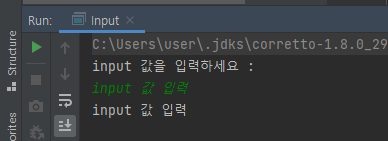

StringCalculator
========================
method 및 클래스 정리
--------------------------
#### `Scanner`
- 객체를 생성하고 읽어들이는 기능
- 실행창에서 값을 입력하고 출력 방식
- java.util 패키지의 Scanner 클래스
- `nextLine` : 입력받은 문자열을 저장
  
##### 실행 코드
```java
// input 출력
public static void main(String[] args) {
    Scanner scanner = new Scanner(System.in);
    System.out.println("input 값을 입력하세요 : ");
    String inputValue = scanner.nextLine();
    System.out.println(inputValue);
}
```
##### 결과

##### scanner 입출력 단위 테스트의 어려움
- 사용자 입출력(UI)과 관련된 테스트는 가능하지만 구현이 어려운 부분 
- 테스트 코드는 컴퓨터가 실행하는 코드라 사용자의 입력이 필요한 스캐너를 만나면 존재하지도 않는 사용자의 입력을 계속 기다리면서 에러발생

<br>

## 단위 테스트와 예외처리 
- 하나의 테스트에 1가지 기능만 테스트하기
- 정상적인 케이스와 예외 상황 테스트는 다른 테스트 영역임
- 테스트의 크기가 작을수록 코드 작성과 수정 및 실행 쉬움
- 모든 기능을 한 번에 테스트할 때, 최상단 혹은 최상단에 가까운 클래스를 테스트하면 자연스럽게 하위 클래스도 테스트되는 원리
#### 나누기 단위테스트 
- 나누기 기능 테스트
- 나눌 수 없는 예외 테스트 
##### main 클래스 메소드
```java
public int div(int number1, int number2) {
    try {
        return number1 / number2;
    } catch (ArithmeticException e) {
        throw new IllegalArgumentException("0으로는 나눌 수 없습니다.");
    }
}
```
##### 테스트 클래스 메소드
```java
// 나누기 기능 테스트
@ParameterizedTest
@CsvSource(value = {"4,2","4,3"})
void divTest(int num1, int num2) {
    // given
    Operator operator = new Operator();

    // when
    int expected = 2;
    int actual = operator.div(num1, num2);

    // then
    assertThat(actual).isEqualTo(expected);
}

// 나누기 예외 상황(0으로 나누기) 테스트
@Test
    void divExceptionTest() {
    // given
    int num1 = 1;
    int num2 = 0;

    // when
    Operator operator = new Operator();

    // then
    assertThatIllegalArgumentException()
            .isThrownBy(() -> operator.div(num1, num2));
}
```


