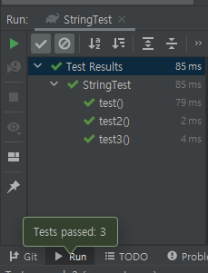

step1. String 클래스에 대한 학습 테스트 
========================
String 클래스에 대한 학습 테스트 
----------------------

### 구현 기능 정리 
#### 요구사항1
- "1,2"을 ,로 split 했을 때 1과 2로 잘 분리되는지 확인하는 학습 테스트를 구현한다. 
    => `String[]`: String 나누어 담을 배열 생성하기 
    =>  `assertj의 contains()를 활용해 반환 값이 맞는지 검증`
- "1"을 ,로 split 했을 때 1만을 포함하는 배열이 반환되는지 학습 테스트를 구현한다.
    => `assertj의 containsExactly()를 활용해 반환 값이 맞는지 검증`

#### 요구사항2
- "(1,2)" 값이 주어졌을 때 String의 ??? 메소드를 활용해 ()을 제거하고 "1,2"를 반환하도록 구현한다.
    => `replace` 사용하기
    => 의문사항: `replaceAll` 사용하니 오류 발생

#### 요구사항3
- "abc" 값이 주어졌을 때 String의 ??? 메소드를 활용해 특정 위치의 문자를 가져오는 학습 테스트를 구현한다.
    => `charAt` 사용하기
- String의 ??? 메소드를 활용해 특정 위치의 문자를 가져올 때 위치 값을 벗어나면 `StringIndexOutOfBoundsException`이 발생하는 부분에 대한 학습 테스트를 구현한다.
    => `예외 처리하기`
```java
// 예외처리 구문
assertThatThrownBy(() -> {
    기능 구현;}).
    isInstanceO({에러명}.class);
}
```
- JUnit의 @DisplayName을 활용해 테스트 메소드의 의도를 드러낸다.

<br/>

### 테스트 구현
```java
package step1;

import org.junit.jupiter.api.Test;

import static org.assertj.core.api.Assertions.assertThat;
import static org.assertj.core.api.Assertions.assertThatThrownBy;

public class StringTest {
    // 요구사항 1
    @Test
    void test() {
        final String[] testvalue = "1,2".split(",");
        final String[] testvalue2 = "1".split(",");
        assertThat(testvalue).contains("1", "2");
        assertThat(testvalue[0]).isEqualTo("1");
        assertThat(testvalue2).containsExactly("1");
    }

    // 요구사항 2
    @Test
    void test2() {
        final String testvalue3 = "(1,(2)".replace("(", "").
                replace(")", "");
        assertThat(testvalue3).isEqualTo("1,2");
        assertThat(testvalue3).contains("1,2");
    }

    // 요구사항 3
    // 문자열 길이 초과해서 예외처리 확인하기
    @Test
    void test3() {
        final String testvalue4 = "abc";
        assertThatThrownBy(() -> {
                testvalue4.charAt(4);
        }).isInstanceOf(StringIndexOutOfBoundsException.class);
    }
}
```
- 실행결과

